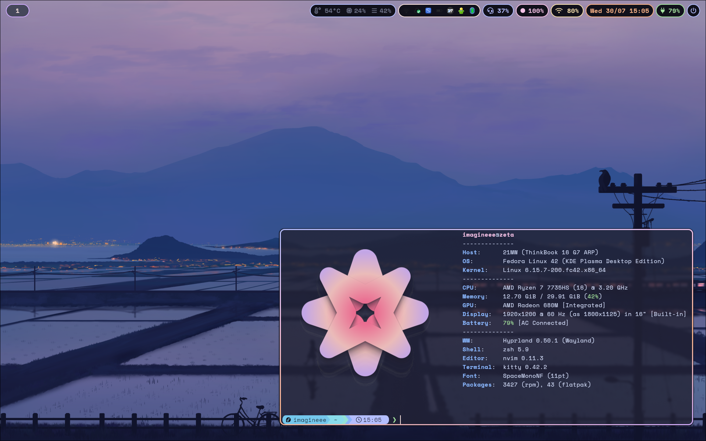
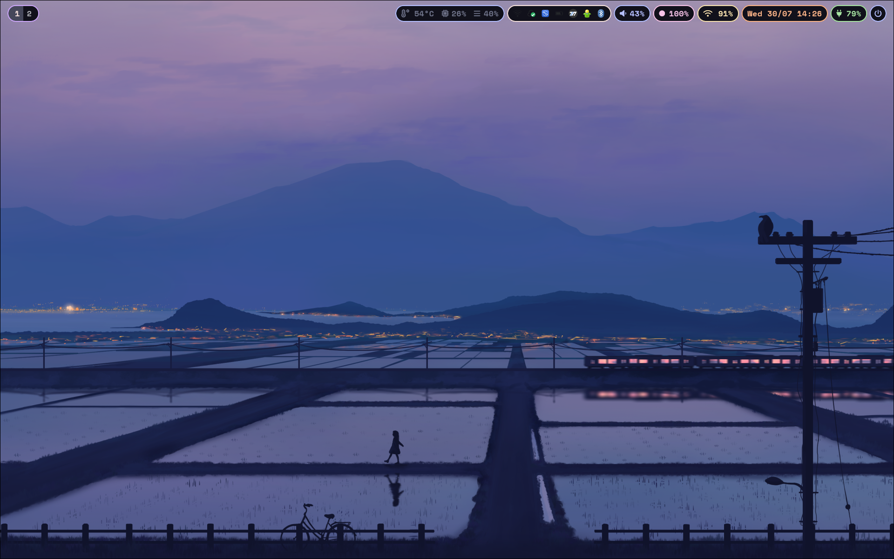
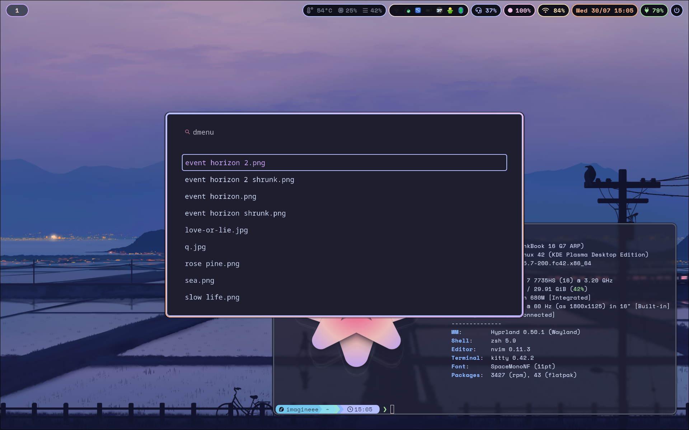
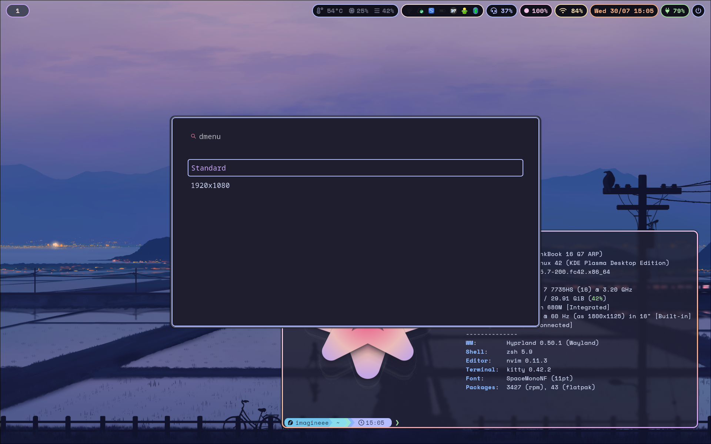
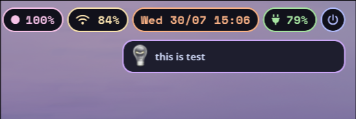

# Desktop Dotfiles

Includes dotfiles for my linux **desktop** setup.
Specially designed for my laptop.

[Preview Video](https://clip.place/w/u6H9x3KmbpRfyhqGLgv9Jb)

# Main software

- [Hyprland](https://hypr.land) - Tiling window manager. [[Install](https://wiki.hypr.land/Getting-Started/Installation/)], remember to install [hypr ecosystem components](#extra-hypr-ecosystem) (**KDE Plasma 6** as secondary DE)
- [Waybar](https://github.com/Alexays/Waybar) - status bar. [[Install](https://github.com/Alexays/Waybar/wiki/Installation)]
- [Dunst](https://dunst-project.org) *or* [Swaync](https://github.com/ErikReider/SwayNotificationCenter) - Notification daemon to receive notifications. Two of them as SwayNC dosen't work right now, thus dunst. [[Install dunst](https://github.com/dunst-project/dunst?tab=readme-ov-file#installation) | [Install Swaync](https://github.com/ErikReider/SwayNotificationCenter?tab=readme-ov-file#install)]
- [Kitty](https://sw.kovidgoyal.net/kitty/) - Terminal, simple as that. Might change it. [Install from package manager]
- [wlogout](https://github.com/ArtsyMacaw/wlogout/) - logout menu. [Install](https://github.com/ArtsyMacaw/wlogout/tree/master?tab=readme-ov-file#install)
- [nwg-dock-hyprland](https://github.com/nwg-piotr/nwg-dock-hyprland) - A dock for currently running apps. [Install](https://github.com/nwg-piotr/nwg-dock-hyprland?tab=readme-ov-file#installation)

## Extra required software

- [wttrbar](https://github.com/bjesus/wttrbar) - Weather in waybar. (Compiled)
- [Music player waybar](https://github.com/imagineeeinc/music-player-waybar) - Currently playing music in waybar. (Compiled)
- [Cava](https://github.com/karlstav/cava) - Music visualizer (Package manager)
- [Blueman applet](https://github.com/blueman-project/blueman) - Bluetooth manager gui. (Package manager)
- [Network Manager](https://gitlab.freedesktop.org/NetworkManager/NetworkManager) - Network manager gui. (Package manager)
- [Hyprshot](https://github.com/Gustash/hyprshot) - screenshot tool (Copy the script)
- [Emote](https://github.com/tom-james-watson/Emote) - Emoji picker (Flathub)
- qt6ct & nwg-look - qt & gtk theme manager (respectively) (Package manager)
- [Rosepine cursor](https://github.com/rose-pine/cursor) - Cursor theme (Manual install)
- [nwg-displays](https://github.com/nwg-piotr/nwg-displays) - Display output manager (Compiled)

## Extra Hypr Ecosystem

- Hypridle
- Hyprlock
- Hyprpaper
- Hyprpolkitagent
- Hyprshot

## Installing

Use gnu stow.

## Gallery

*Outdated*

**Empty**

**Floating window**

**Wallpaper selector**

**Display resolution selector**

**A notification**

