# HoshiOS

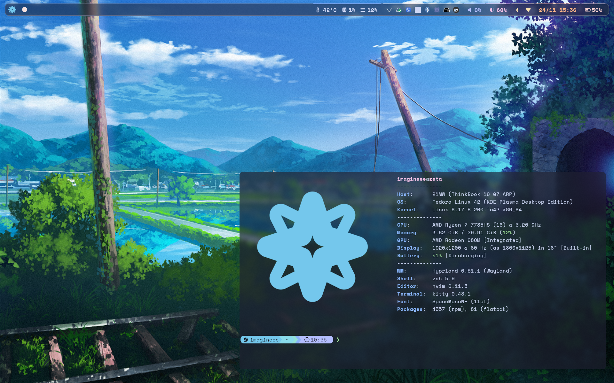

Includes dotfiles for my linux **desktop** setup.
Geared more towared laptops.

[Preview Video (*Outdated*)](https://clip.place/w/u6H9x3KmbpRfyhqGLgv9Jb)

## Main software

- [Hyprland](https://hypr.land) - Tiling window manager. [Install](https://wiki.hypr.land/Getting-Started/Installation/), remember to install hypr ecosystem components listed bellow (**KDE Plasma 6** as secondary DE)
  - Hypridle
  - Hyprlock
  - ~~Hyprpaper~~ Deprecated, superseded by [awww](https://codeberg.org/LGFae/awww)
  - Hyprpolkitagent
- [Fabric](https://wiki.ffpy.org) - Widget system in python. [Install](https://wiki.ffpy.org/getting-started/installation-guide/)
- [awww](https://codeberg.org/LGFae/awww) - Wallpaper system. [Install: `cargo install awww awww-daemon --git https://codeberg.org/LGFae/awww.git`]
- [Waybar](https://github.com/Alexays/Waybar) - status bar. [[Install](https://github.com/Alexays/Waybar/wiki/Installation)]
- [Dunst](https://dunst-project.org) - Notification daemon to receive notifications. [Install](https://github.com/dunst-project/dunst?tab=readme-ov-file#installation)
- [tofi](https://github.com/philj56/tofi) - App launcher [Install](https://github.com/philj56/tofi)
- [wofi](https://github.com/SimplyCEO/wofi) - Graphical menu [Install](https://github.com/SimplyCEO/wofi?tab=readme-ov-file#installing) (Also available on package manager)
- [Kitty](https://sw.kovidgoyal.net/kitty/) - Terminal, simple as that. [Install from package manager]
- [wlogout](https://github.com/ArtsyMacaw/wlogout/) - logout menu. [Install](https://github.com/ArtsyMacaw/wlogout/tree/master?tab=readme-ov-file#install)
- [nwg-dock-hyprland](https://github.com/nwg-piotr/nwg-dock-hyprland) - A dock for currently running apps. [Install](https://github.com/nwg-piotr/nwg-dock-hyprland?tab=readme-ov-file#installation)
- [doas](https://github.com/Duncaen/OpenDoas) - sudo replacement, used to allow certain commands to run with out password prompt (or fingerprint). [package manager]

## Extra required software

- [wttrbar](https://github.com/bjesus/wttrbar) - Weather in waybar. (Compiled)
- [Music player waybar](https://github.com/imagineeeinc/music-player-waybar) - Currently playing music in waybar. (Compiled)
- [Cava](https://github.com/karlstav/cava) - Music visualizer (Package manager)
- [Blueman applet](https://github.com/blueman-project/blueman) - Bluetooth manager gui. (Package manager)
- [Network Manager](https://gitlab.freedesktop.org/NetworkManager/NetworkManager) - Network manager gui. (Package manager)
- [Hyprshot](https://github.com/Gustash/hyprshot) - Screenshot tool (Package manager)
- [Emote](https://github.com/tom-james-watson/Emote) - Emoji picker (Flathub)
- qt6ct & nwg-look - qt & gtk theme manager (respectively) (Package manager)
- [Rosepine cursor](https://github.com/rose-pine/cursor) - Cursor theme (Manual install)
- [nwg-displays](https://github.com/nwg-piotr/nwg-displays) - Display output manager (Compiled)
- [iwmenu](https://github.com/e-tho/iwmenu) - dmenu based wifi manager, reliant on iwd [refer to [this](https://discussion.fedoraproject.org/t/howto-replace-wpa-supplicant-with-iwd-a-newer-wireless-daemon/144111) for switching to iwd on Fedora] (Install: `cargo install iwmenu --git https://github.com/e-tho/iwmenu.git`)
- [bzmenu](https://github.com/e-tho/bzmenu) - dmenu based bluetooth manager (Install: `cargo install bzmenu --git https://github.com/e-tho/bzmenu.git`)
- [pwmenu](https://github.com/e-tho/pwmenu) - demenu based pipewire manager (Install: `cargo install pwmenu --git https://github.com/e-tho/pwmenu.gi`)

## Installing

Use gnu stow.

## Gallery

**Empty**

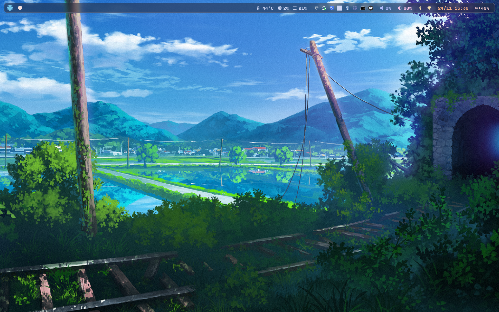

**Floating Terminal**

**Floating window**

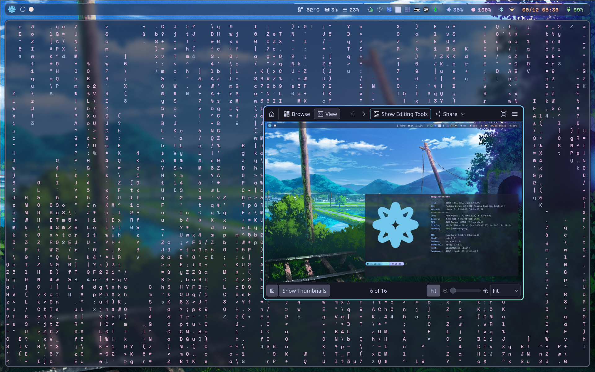

**Wallpaper selector**

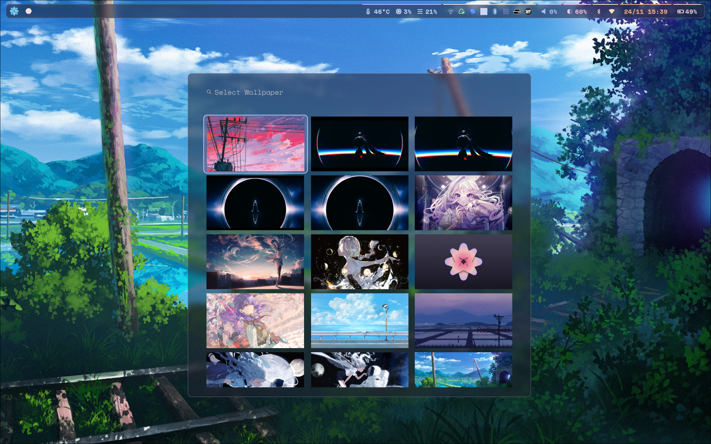

**Display resolution selector** (allows you to change resolution of other displays when connected)

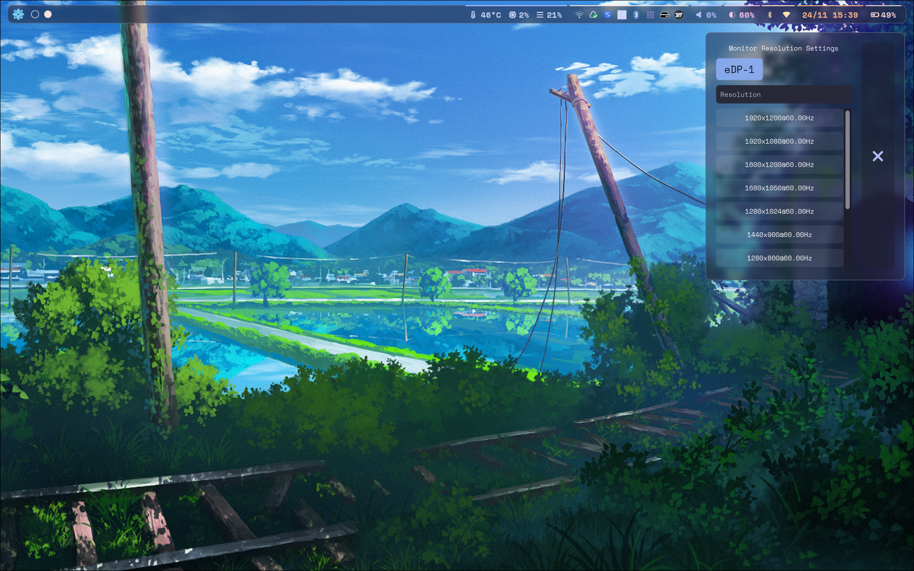

**Monitor placement**

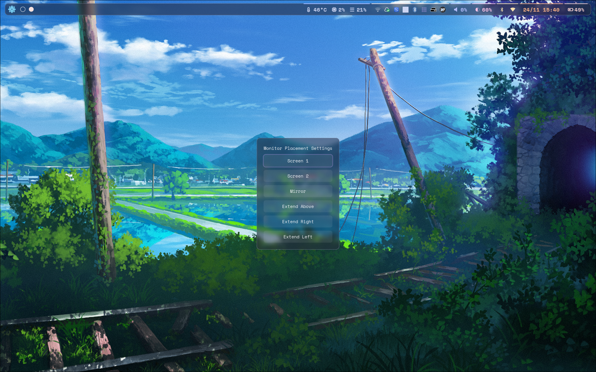

**Monitor brightness**

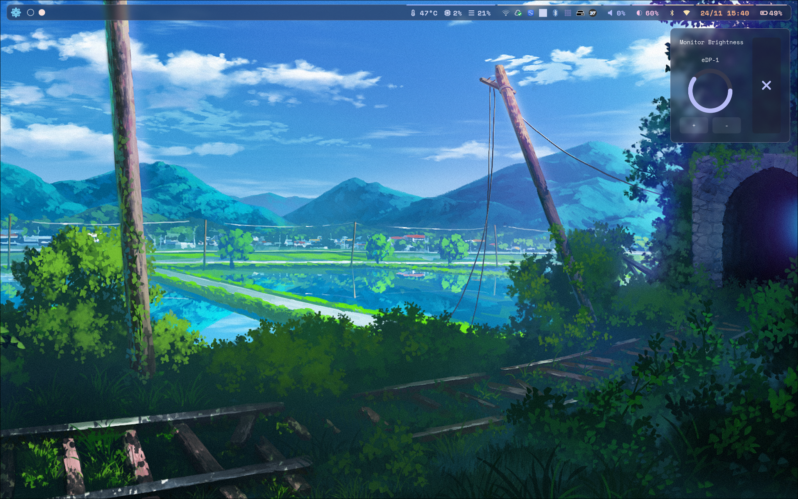

**A notification**

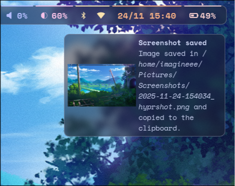

**System menu**

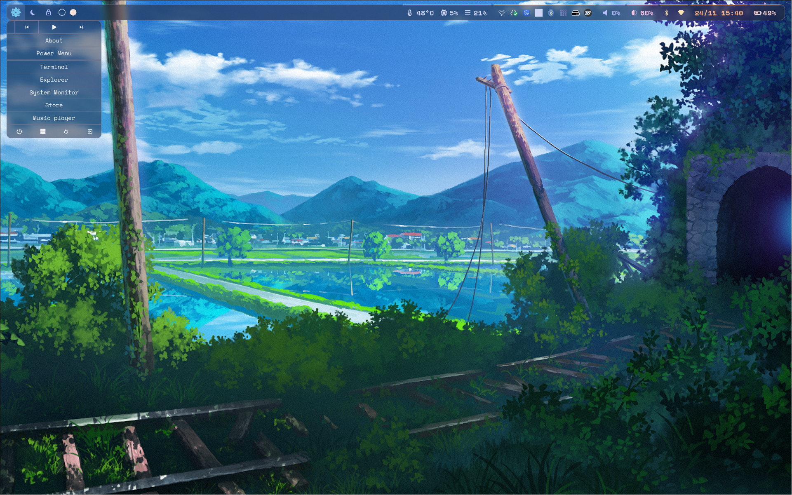

**Dock**

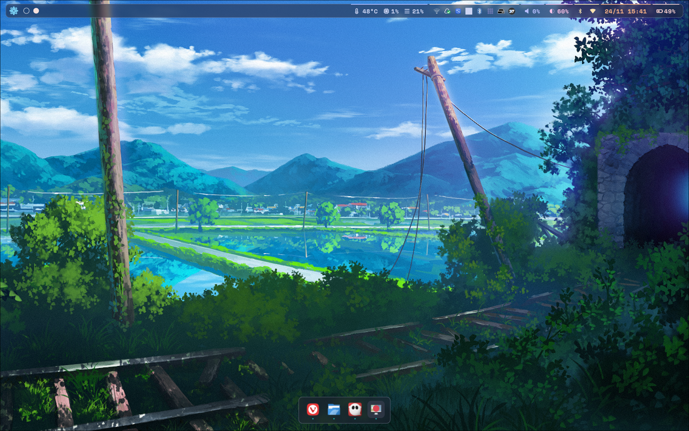

**App lancher**

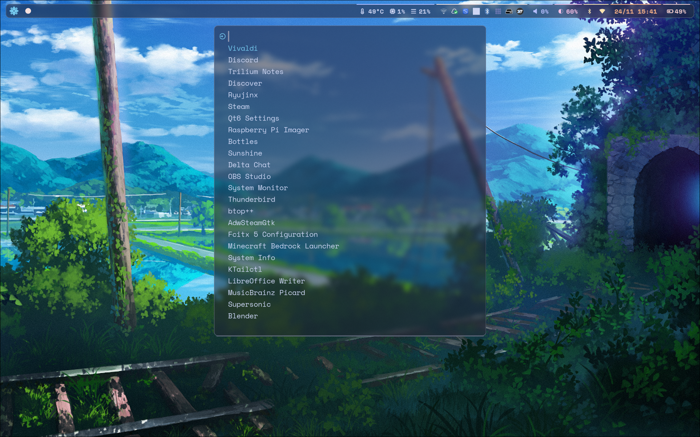

**Logout menu**

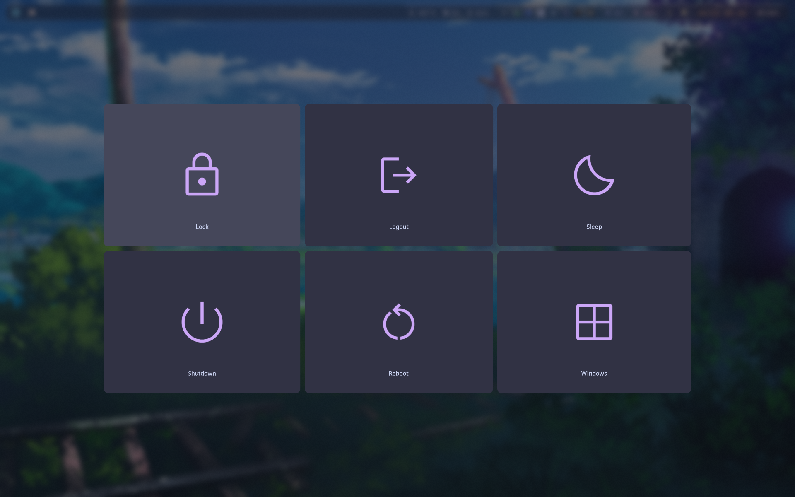
